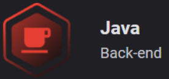

<!-- markdownlint-disable MD033 -->

# Ignite Trilha Java - Prática: Gestão de Vagas

   

  
  
  
  

## Sumário

- [Ignite Trilha Java - Prática: Gestão de Vagas](#ignite-trilha-java---prática-gestão-de-vagas)
  - [Sumário](#sumário)
  - [Sobre o Projeto](#sobre-o-projeto)
    - [Módulo 3 - Gestão de Vagas](#módulo-3---gestão-de-vagas)
      - [Informações relevantes](#informações-relevantes)
    - [Módulo 4 - Documentação](#módulo-4---documentação)
      - [Informações relevantes](#informações-relevantes-1)
    - [Módulo 5 - Testes e Qualidade de Código](#módulo-5---testes-e-qualidade-de-código)
    - [Módulo 6 - Implantação e Monitoramento](#módulo-6---implantação-e-monitoramento)
  - [Tecnologias](#tecnologias)
    - [Principais Bibliotecas (Packages)](#principais-bibliotecas-packages)
  - [Licença](#licença)

## Sobre o Projeto

> Informações importantes: [anotações](./.github/docs/b_annotations.md).
>
> Análise interpretativa e lógica do [código](./.github/docs/c_code-analysis.md)
>
> Avaliação do Aprendizado: [Quizzes e Questionários](./.github/docs/d_quizzes-e-questionarios.md)

### Módulo 3 - Gestão de Vagas

Desenvolvimento de uma API REST para controles de Empresas, vagas e aplicações, utilizando-se das principais ferarmentas do Spring Boot para persistência, segurança e autorização.

#### Informações relevantes

- Para acessar o canco de dados através da conexão do banco de dados Postgres, execute o comando `docker-compose -build -d`. As configurações do container já estão conngiguradas no arquivo `docker-compose.yml`.
- Uma vez o container montado, não é necessáio mais buildar: `docker-compose up -d`.
- Nome do usuário e senha disponíveis no arquivo `resources/application.properties`.

### Módulo 4 - Documentação

Criação da documentação da aplicação desenvolvida no módulo 3, utilziando o Swagger, que é uma das ferramentas mais utilziadas para a criação de documentação. Através dela foi definido exemplos de requisições e retornos.

#### Informações relevantes

- Rota de acesso a documentação: `http://localhost:8080/swagger-ui/index.html`

### Módulo 5 - Testes e Qualidade de Código

Aprender sobre como inserir testes dentro da aplicação, utilizando JUnit e Mockito, com testes de integração e testes unitários.

- Aplicar SonarQube junto ao Docker: `docker run -d --name sonarqube -e SONAR_ES_BOOTSTRAP_CHECKS_DISABLE=true -p 9000:9000 sonarqube:9.9.0-community`

### Módulo 6 - Implantação e Monitoramento

## Tecnologias

### Principais Bibliotecas (Packages)

- [`Spring Boot`](https://spring.io/)
- [`Project Lombok`](https://projectlombok.org/)
- [`Docker`](https://www.docker.com/)
- [`PostgreSQL`](https://www.postgresql.org/)
- [`java-jwt`](https://github.com/auth0/java-jwt)
- [`Swagger`](https://swagger.io/)
- [`JUinit`](https://junit.org/junit4/)
- [`H2 Database`](https://www.h2database.com/html/main.html)

> Mais informações sobre [dependências do projeto](./.github/docs/a_dependencies.md).

## Licença

Distribuído sob a licença *MIT*. Veja [LICENSE](LICENSE) para mais informações.

---

<h5 align="center">
  2023 - <a href="https://github.com/mgckaled/">Marcel Kaled</a>
</h5>
